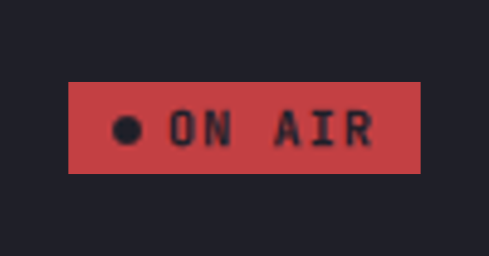
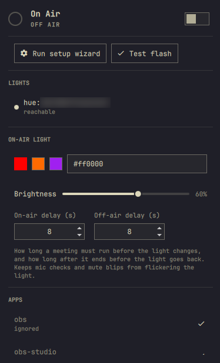

# Omarchy On-Air Plugin

<p align="center">

</p>

An [Omarchy](https://omarchy.org) (Quattro) plugin. When you join a meeting, your smart
lights turn red and an **ON AIR** indicator appears in the bar. When the meeting ends,
the lights are restored to their previous state.

Detection watches your microphone and camera: Zoom, Teams, Google
Meet, Slack huddles, Discord, and anything else that opens an input stream all trigger
it, labeled where recognized and shown by binary name otherwise. Recording tools (OBS
and friends) are ignored by default so they never trip the light on their own but a
meeting running alongside one still counts. A level meter is not a meeting: a VU bar
(the Omarchy audio panel, pavucontrol) opens a genuine capture stream but marks it
`media.category = Monitor`, and those never count.

Plugin id: `joegeary.on-air`

## Requirements

- **curl** and **jq** - required. `bin/on-air` refuses to run without them and names
  whichever is missing.
- **gum** - optional. The `on-air setup` wizard uses it for nicer prompts when
  installed, and falls back to plain `read -p` when it isn't.
- **avahi-browse** - optional. Speeds up Hue bridge discovery on the local network;
  setup falls back to Philips' cloud discovery endpoint and then a manual IP prompt
  when it's missing.
- One of:
  - A **Philips Hue** bridge (v2 CLIP API), reachable on your LAN.
  - A **Home Assistant** instance (any light platform HA supports - including LIFX -
    works through it), reachable over HTTP(S) with a long-lived access token.

All light control happens through `bin/on-air`, a standalone bash CLI with no
dependency on the Omarchy shell - see [Usage](#usage) if you want to drive it directly
or script around it.

## Install

```bash
omarchy plugin add https://github.com/joegeary/omarchy-on-air --enable
```

Then add the bar widget, either from the widget picker (Setup → Bar → Add widget →
**On Air**) or directly:

```bash
omarchy bar put joegeary.on-air --section right
```

## Setup

Light control needs a one-time pairing step, done from a terminal (not the bar popup -
pairing involves physical button presses and secret tokens that don't belong in a UI
flow). The CLI ships inside the plugin directory, so it isn't on your `PATH`:

```bash
~/.config/omarchy/plugins/joegeary.on-air/bin/on-air setup
```

You can also add it to your path by symlinking it to `~/.local/bin`:

```bash
ln -s ~/.config/omarchy/plugins/joegeary.on-air/bin/on-air ~/.local/bin/on-air
```

The symlink survives `omarchy plugin update`; see [Removal](#removal) for cleaning it
up. The rest of this README writes the command as plain `on-air`.

The wizard walks you through:

1. **Choose a driver** - Hue or Home Assistant.
2. **Hue**: discovers bridges on your network (avahi, then Philips' cloud discovery
   endpoint, then a manual IP prompt as a last resort), then asks you to **press the
   physical link button on the bridge**. It retries pairing every couple of seconds
   until you press it or cancel.
3. **Home Assistant**: asks for your instance's base URL and a **long-lived access
   token** (create one from your HA user profile → Security → Long-lived access
   tokens), and validates it against the API before saving.
4. **Pick lights** - you can select any number of lights/entities as on-air targets.
   Lights that can't display red (color-temperature-only, dim-only, or on/off-only
   fixtures such as a smart plug) are flagged so you know what to expect.
5. **Test flash** - flashes the selected lights red for a few seconds and restores
   them, so you can confirm it works before trusting it to a real meeting.

Re-run `on-air setup` any time to add/remove targets or switch drivers. It's also
reachable from the bar popup's "Run setup wizard" button, which opens it in a terminal.

## Usage

### Bar widget states

| State | Appearance |
|---|---|
| Off air | A podcast glyph (󰦔) at normal bar brightness, so the manual toggle is always reachable; disable "Show icon when off-air" in the widget settings to hide it instead |
| Pending | A dim, pulsing dot - a capture started but hasn't been sustained long enough yet |
| On air | A red pill: broadcast glyph + "ON AIR" |
| Paused | A distinct pill variant, always shown regardless of the idle-icon setting |
| Degraded | A neutral, disabled glyph - shown if the service isn't reachable |

Hovering the pill shows the detected app, elapsed time, and how many lights were set
(or the first failure, if any).

### Popup panel



Left-click the bar icon to open the popup:

- **Header toggle** - off air, switching it on puts you on-air manually (stays on
  until you switch it off; no auto-clear). During a real meeting, switching it off
  **pauses** detection for that meeting only (lights restore immediately; switching
  back on re-applies on-air and re-snapshots, since the light may have changed while
  paused).
- **Actions** - "Run setup wizard" and "Test flash", kept directly under the header so
  setup is reachable without scrolling.
- **Status** - each configured light/entity, a reachability dot, and the last error
  if any; the apps currently holding a capture.
- **Settings** - on-air color (preset swatches or a hex field), brightness, and the
  on-air / off-air delays (how long a meeting must run before the light changes, and
  how long after it ends before the light goes back).
- **Ignore list** - one-click "ignore" for anything currently detected that shouldn't
  trigger On Air (e.g. a dictation tool), and "unignore" for anything on the list.

Right-click the bar icon for a quick pause/resume without opening the popup.

### Pause

Pause is scoped to the current meeting: it auto-expires once the capture has been
quiet for the configured `clearSeconds`. Pausing restores your lights immediately; 
the snapshot is kept so unpausing mid-meeting still has something correct to work 
from (though unpausing re-snapshots fresh regardless, in case the light changed while paused).

### CLI reference

`bin/on-air` is a plain bash script; every command works standalone (see
[Configuration](#configuration) for `ON_AIR_CONFIG`/`ON_AIR_STATE` overrides useful for
testing).

| Command | Description |
|---|---|
| `on-air setup` | Interactive wizard: pick driver, discover, pair, choose lights, test flash, write config |
| `on-air trigger` | Ensure on-air: snapshot current state (only if no snapshot exists yet), apply the on-air color |
| `on-air clear [--keep-snapshot]` | Restore lights from the snapshot |
| `on-air pause` | Restore the lights but keep the snapshot (meeting-scoped pause) |
| `on-air unpause` | Leave pause; the next `trigger` re-snapshots fresh |
| `on-air test` | Flash the on-air color for 3 seconds then restore; refuses to run while a real snapshot exists |
| `on-air detect --json` | One-shot capture-holder set (`{"audio":[…],"video":[…],"warnings":[…]}`), for diffing detection standalone. `warnings` is non-empty when a detection tool (`pactl`, `fuser`) is missing, so an empty result is never mistaken for "nothing is capturing" |
| `on-air status` | Prints config (secrets redacted), per-target reachability, and the last 10 log events |
| `on-air config --json` | Prints the merged config as JSON, for the QML layer or scripting |
| `on-air config set <dotted.key> <json-value>` | Edits one config value (validated, written atomically); pass `-` as the value to read it from stdin, which is how a target carrying a secret has to be set |
| `on-air ignore add\|remove <bin>` | Adds/removes an app binary name from `ignoreApps` |
| `on-air purge [--yes]` | Restores any on-air lights, then deletes config and state after confirmation |
| `on-air version` | Prints the CLI version |

Every mutating command prints exactly one JSON result line on stdout, e.g.:

```json
{"state":"on_air","ok":["hue:<uuid>"],"failed":[{"target":"hue:<uuid>","error":"timeout"}]}
```

Exit codes: `0` everything converged, `2` partial failure, `3` total failure, `1`
config/usage error.

### IPC (keybinds and scripting)

The running service also answers over the shell's IPC, which needs no `PATH` setup and
goes through the same state machine the bar widget uses:

```bash
omarchy-shell on-air status    # JSON: state, detected app, per-target health
omarchy-shell on-air toggle    # manual on-air on/off, or pause/resume during a meeting
omarchy-shell on-air pause     # no-op with "not on air" when there's nothing to pause
omarchy-shell on-air resume
omarchy-shell on-air refresh   # force a detection sweep and config re-read
```

Prefer these over `on-air trigger`/`clear` in keybinds: the CLI moves the lights
directly, while IPC keeps the service's own state in sync with them.

## Configuration

Config lives at `~/.config/on-air/config.json` (directory mode `700`, file mode `600`,
always written temp-then-rename). Edit it with `on-air config set`, the bar popup, or
`on-air setup` - hand-editing works too, but the version field is checked on every load
and an unrecognized version fails loudly rather than half-applying.

```json
{
  "version": 1,
  "onAir": { "color": "#ff0000", "brightnessPercent": 100 },
  "riseSeconds": 8,
  "clearSeconds": 8,
  "ignoreApps": ["obs", "obs-studio", "cheese", "guvcview"],
  "appNames": { "zoom": "Zoom", "teams-for-linux": "Teams", "slack": "Slack", "discord": "Discord" },
  "targets": [
    { "driver": "hue", "bridgeId": "<bridge-id>", "bridge": "<bridge-ip>", "appKey": "<hue-application-key>", "certPin": "<sha256>", "lights": ["<uuid>"] },
    { "driver": "home_assistant", "baseUrl": "http://homeassistant.local:8123", "token": "<long-lived-token>", "lights": ["light.office"] }
  ]
}
```

- `onAir.color` / `onAir.brightnessPercent` - the color (hex) and brightness (percent)
  applied while on-air. Each driver converts these to its own native scale.
- `riseSeconds` / `clearSeconds` - the on-air and off-air delays: how long a capture
  must be continuously held before the light changes, and how long everything must
  stay quiet after a meeting before it restores. They absorb mic checks and
  mute-toggle flapping. Shown in the panel as "On-air delay" / "Off-air delay".
- `ignoreApps` - binary names that never count as a meeting on their own (recording
  tools, dictation tools, etc). Manage with `on-air ignore add|remove` or the popup's
  ignore section.
- `appNames` - maps a binary name to a friendly label shown in the bar/popup. Unknown
  apps still trigger; they just show their raw binary name.
- `targets` - one entry per light/entity, each naming its `driver` (`hue` or
  `home_assistant`) plus that driver's own connection details. Multiple targets across
  drivers are supported; one target failing never blocks the others.

Nothing security-sensitive is ever generated or stored anywhere inside this repo - all
of the above lives under `~/.config/on-air` and `~/.local/state/on-air`, both outside
the plugin's installed directory.

For standalone runs and testing, override the config/state locations:

```bash
ON_AIR_CONFIG=/tmp/oa/cfg.json ON_AIR_STATE=/tmp/oa ./bin/on-air setup
```

## Development

Both test suites are dependency-free, run offline, and never touch a real light:

```bash
node StateMachine.test.js   # detection hysteresis, synthetic traces
bash tests/run.sh           # the CLI end to end, through drivers/mock.sh and a
                            # stubbed Home Assistant (no sockets are opened)
omarchy plugin validate .
dev/sync.sh                 # copy into ~/.config/omarchy/plugins and validate

# qmllint ships in qt6-declarative and is not on PATH by default on Arch
/usr/lib/qt6/bin/qmllint -I "$OMARCHY_PATH/shell" *.qml
```

## Removal

```bash
omarchy plugin remove joegeary.on-air --yes
rm -rf ~/.config/on-air ~/.local/state/on-air   # or: on-air purge, before removing the plugin
rm -f ~/.local/bin/on-air                       # only if you made the symlink during setup
```

This deletes your stored Hue application key and/or Home Assistant long-lived token
along with the rest of the config and state. Note: **the Hue application key is not
revoked on the bridge by deleting it locally** - it stays valid until you remove it
from the bridge's authorized-apps list in the Hue app (Settings → Hue Bridges → your
bridge → ... → Apps).

## Security notes

- Secrets (Hue application key, Home Assistant token) live only in
  `~/.config/on-air/config.json`, mode `600`, inside a `700` directory - never
  committed, never logged in full.
- Secrets never appear in process argv: curl receives headers via `--config -` on
  stdin, so nothing lands in `/proc/*/cmdline` where any local user could read it.
- `on-air status` redacts every secret to its last 4 characters, in both the config it
  prints and the snapshot's copy of each target.
- `on-air config set targets` refuses a target carrying an `appKey`/`token` on the
  command line; pipe it in (`… | on-air config set targets -`) or use `on-air setup`.
- No telemetry and no runtime fetching of remote code: `bin/on-air` and `drivers/*.sh`
  are plain-text scripts shipped in this repo; every network call they make is a
  direct HTTP request to a bridge or Home Assistant instance you configured yourself.
- The driver dispatcher only sources `drivers/<name>.sh` after validating `<name>`
  against an allowlist of shipped drivers - a config value is never treated as a path.
- The plugin writes only to `~/.config/on-air` and `~/.local/state/on-air`; it never
  touches other Omarchy or shell config.

## Troubleshooting

- `on-air status` - shows redacted config, per-target reachability, and the last 10
  log events (state transitions + driver results) from `~/.local/state/on-air/log`.
- QML/service errors: the shell writes its own log - find it with
  `ls /run/user/$UID/quickshell/by-pid/$(pgrep -x quickshell)/` and read it with
  `qs log <that dir>/log.qslog`. (On installs that run the shell as a systemd unit,
  `journalctl --user -fu omarchy-shell` works instead.)
- **Bar icon missing after a plugin update or hot reload**: we have seen the shell
  occasionally fail to re-mount a third-party bar widget after its files change on
  disk (the service keeps running - `omarchy-shell on-air status` still answers).
  Any bar-layout write remounts it, e.g.
  `omarchy bar set joegeary.on-air showWhenIdle true --json`, or restart
  the shell. This is a shell-side race, not plugin state; nothing is lost.
- A widget stuck showing "light stuck on-air" means a snapshot has unrestored entries
  after every retry attempt so far; the service keeps retrying `clear` on a capped
  backoff rather than abandoning a red light. Check `on-air status` for the specific
  failure.
- If the bar shows the degraded/disabled glyph, the service isn't reachable from the
  widget - reload the plugin (`omarchy-shell shell rescanPlugins`) or check the
  journal for a QML load error.

## License

MIT - see [LICENSE](LICENSE).
